# EduSystemDesign Full Roadmap

## Phase 1: Critical Bug Fixes and Code Health

The app has several issues ranging from build-breaking to lint-level. These must be resolved first because some prevent the app from building or cause visual regressions.

### 1.1 Fix missing `fonts.css` (P0 - build-breaking)

[src/styles/index.css](src/styles/index.css) imports `./fonts.css` which does not exist. Two options:
- Create an empty `src/styles/fonts.css` if no custom fonts are needed
- Or remove the import line entirely

Recommendation: create a minimal `fonts.css` with an Inter/system font import so the app has a consistent typeface foundation.

### 1.2 Fix `react`/`react-dom` as peer dependencies (P0)

In [package.json](package.json), `react` and `react-dom` are peer dependencies marked optional. pnpm may not install them. Move them to `dependencies`:
```json
"dependencies": {
  "react": "^18.3.1",
  "react-dom": "^18.3.1",
  ...
}
```
Remove the `peerDependencies` and `peerDependenciesMeta` blocks.

### 1.3 Fix broken dynamic Tailwind classes on HomePage (P1)

In [src/app/pages/HomePage.tsx](src/app/pages/HomePage.tsx) line 224, dynamic interpolation like `` bg-${item.color}-100 `` produces classes Tailwind cannot detect at build time. Replace with a static color map:

```typescript
const COLOR_MAP: Record<string, string> = {
  blue: "bg-blue-100 text-blue-700",
  green: "bg-green-100 text-green-700",
  purple: "bg-purple-100 text-purple-700",
  orange: "bg-orange-100 text-orange-700",
};
```

Then use `COLOR_MAP[item.color]` in the className.

### 1.4 Fix PosterView custom DOM toast (P1)

[src/app/pages/PosterView.tsx](src/app/pages/PosterView.tsx) defines a local `toast()` function (line 84) that creates raw DOM elements, shadowing Sonner's `toast`. Fix:
- Add `import { toast } from "sonner"` at the top
- Delete the local `toast` function (lines 84-89)

### 1.5 Fix Sonner/next-themes without ThemeProvider (P1)

[src/app/components/ui/sonner.tsx](src/app/components/ui/sonner.tsx) uses `useTheme` from `next-themes` but no `ThemeProvider` wraps the app. Replace with a direct Sonner import that hard-codes `theme="system"` or reads from our own future theme context. This also allows removing `next-themes` from dependencies entirely once dark mode is added with a custom provider (Phase 2).

### 1.6 Fix unused imports and dead code (P2)

- [src/app/pages/PersonaEditor.tsx](src/app/pages/PersonaEditor.tsx): remove unused `Progress` import (line 10)
- [src/app/pages/ComparePersonas.tsx](src/app/pages/ComparePersonas.tsx): change `const [personas, setPersonas]` to `const [personas]` (line 105)
- Delete [src/app/components/figma/ImageWithFallback.tsx](src/app/components/figma/ImageWithFallback.tsx) -- never imported anywhere

### 1.7 Extract shared types to `lib/types.ts` (P2)

The `Persona` interface is exported from `PersonaEditor.tsx` (a page component) and imported by `PosterView` and `ComparePersonas`. The `JourneyStep` interface is duplicated in `JourneyMapEditor.tsx` and `PosterView.tsx`.

Create [src/app/lib/types.ts](src/app/lib/types.ts):
- Move `Persona` interface there
- Move `JourneyStep` interface there
- Update all imports across 4 files

### 1.8 Remove unused dependencies (P2)

Remove from `package.json`:
- `@emotion/react`, `@emotion/styled`, `@mui/material`, `@mui/icons-material` (MUI stack -- never imported)
- `@popperjs/core`, `react-popper` (never imported)
- `canvas-confetti` (never imported)
- `motion` (never imported)
- `react-dnd`, `react-dnd-html5-backend` (never imported)
- `react-responsive-masonry` (never imported)
- `react-slick` (never imported)
- `next-themes` (after 1.5 fix removes dependency on it)

### 1.9 Add `tsconfig.json` (P3)

Verify if one exists outside the tracked tree; if not, create a standard Vite + React + TypeScript config with strict mode, path aliases matching `vite.config.ts`, and JSX transform set to `react-jsx`.

### 1.10 Delete dead file (P3)

Remove [default_shadcn_theme.css](default_shadcn_theme.css) from root -- it is never imported and duplicates `theme.css`.

---

## Phase 2: High-Impact Improvements

These features address the biggest UX risks and quality-of-life gaps.

### 2.1 Autosave with visual indicator

**Why:** Users currently lose all work if they navigate away without clicking Save. This is the single biggest UX risk.

**Implementation:**
- Create a `useAutosave(key, data, delay?)` hook in `src/app/lib/useAutosave.ts`
- It debounces writes to `localStorage` (500ms default)
- Returns a `status: "saved" | "saving" | "unsaved"` value
- Add a small status pill in the header of `PersonaEditor`, `JourneyMapEditor`, and `SchoolOnboarding` showing save status
- Add `beforeunload` event listener when status is "unsaved"
- Add React Router navigation blocker (`useBlocker`) for in-app navigation with unsaved changes

**Files changed:** New hook file + edits to `PersonaEditor.tsx`, `JourneyMapEditor.tsx`, `SchoolOnboarding.tsx`

### 2.2 Export/Import school data (JSON)

**Why:** Critical for classroom settings -- students work across sessions/devices, teachers want to distribute pre-configured schools.

**Implementation:**
- Add `exportSchoolData(schoolId)` and `importSchoolData(json)` functions to `schoolStore.ts`
- Export bundles: school object + persona + savedPersonas + journey steps into one JSON
- Add "Export JSON" button to `HomePage` toolbar
- Add "Import JSON" file input to `SchoolSelection` page
- Validate imported data shape before merging

**Files changed:** `schoolStore.ts`, `HomePage.tsx`, `SchoolSelection.tsx`

### 2.3 Dark mode toggle

**Why:** Dark mode CSS tokens already exist in `theme.css` under `.dark`. Just needs a toggle mechanism.

**Implementation:**
- Create `src/app/lib/ThemeProvider.tsx` -- a React context that toggles `.dark` class on `<html>` and persists preference to `localStorage`
- Add `ThemeToggle` button component (sun/moon icon) using `lucide-react`
- Wrap `App.tsx` with `ThemeProvider`
- Update `sonner.tsx` to read from our `ThemeProvider` instead of `next-themes`
- Add toggle to `HomePage` nav bar and `SchoolSelection` header

**Files changed:** New `ThemeProvider.tsx`, new `ThemeToggle.tsx`, `App.tsx`, `sonner.tsx`, `HomePage.tsx`, `SchoolSelection.tsx`

### 2.4 School onboarding: edit mode + draft persistence

**Why:** Currently, navigating to `/school-setup` always creates a new school. No way to edit an existing one. Refreshing mid-wizard loses all data.

**Implementation:**
- Accept optional `?edit=schoolId` query param in `SchoolOnboarding`
- If present, load existing school data into the form
- Persist draft to `sessionStorage` under `onboarding-draft` on every field change
- Restore from `sessionStorage` on mount if draft exists
- Clear draft on successful save
- Sync step index to URL: `?step=3` so refresh preserves position
- Update "Configurer" button on `HomePage` to pass `?edit=schoolId`

**Files changed:** `SchoolOnboarding.tsx`, `HomePage.tsx`

### 2.5 Fix pain points display and Toulouse-specific hardcoding

**Why:** Pain points in Keyce demo use commas not newlines, so they render as one bullet. Neighborhood dropdown in `PersonaEditor` is hardcoded for Toulouse.

**Implementation:**
- In `HomePage.tsx`: split on both `\n` and `,` for pain points and must-haves
- In `PersonaEditor.tsx`: replace the Toulouse neighborhood `Select` with a free-text `Input` with a datalist of suggestions (or remove the hardcoded options entirely)

**Files changed:** `HomePage.tsx`, `PersonaEditor.tsx`

### 2.6 Split PersonaEditor into sub-components

**Why:** At 1094 lines, the file is hard to navigate and maintain. Each tab is independent enough to be its own component.

**Implementation:**
- Create `src/app/components/persona/` directory
- Extract: `PersonaIdentityTab.tsx`, `PersonaPersonalTab.tsx`, `PersonaContextTab.tsx`, `PersonaRoleTab.tsx`, `PersonaSystemTab.tsx`, `PersonaTechTab.tsx`, `PersonaUXTab.tsx`
- Each receives `persona`, `updateField`, `school` as props (or via context)
- Keep field helpers (`F`, `SF`) in a shared `PersonaFields.tsx`
- Main `PersonaEditor.tsx` becomes an orchestrator (~150 lines)

**Files changed:** New directory with 8 files, refactored `PersonaEditor.tsx`

### 2.7 Populate Guidelines.md

**Why:** Currently a blank template. Should contain actual project conventions.

**Implementation:** Write real guidelines covering naming conventions, component patterns, Tailwind usage rules (no dynamic classes), state management approach, and French language requirements.

**Files changed:** `guidelines/Guidelines.md`

---

## Phase 3: Scope Elevations

These features transform the tool from a form-filling app into a complete workshop platform.

### 3.1 School templates (quick-start profiles)

**Why:** Most workshop participants won't carefully fill 9 onboarding steps. Pre-built templates get them working in 2 minutes.

**Implementation:**
- Create `src/app/lib/schoolTemplates.ts` with 4-5 generic templates: "Universite Publique", "Ecole de Commerce", "IUT/BTS", "Ecole d'Ingenieurs", "Ecole d'Art"
- Add a template picker as the first step of `SchoolOnboarding` (before Step 0)
- User picks template -> fields pre-populated -> can customize from there
- Keep "Start from scratch" option

**Files changed:** New `schoolTemplates.ts`, modified `SchoolOnboarding.tsx`

### 3.2 Journey map comparison (overlaid emotion curves)

**Why:** Comparing how Student, Teacher, and Admin experience the same system is the core pedagogical insight.

**Implementation:**
- Add a "Journey Comparison" tab/section to `ComparePersonas.tsx` (or new route `/compare-journeys`)
- Read all 3 journey maps from `localStorage` using per-role keys
- Render a single Recharts `LineChart` with 3 `Line` components (blue/green/purple) overlaid
- Below the chart, a table highlighting where emotions diverge the most (biggest delta between roles at each step)

**Files changed:** `ComparePersonas.tsx` or new page, `routes.ts`

### 3.3 Printable comparison poster

**Why:** Groups need to present all 3 personas side-by-side as a printed artifact.

**Implementation:**
- Add "Export Comparison PDF" button to `ComparePersonas`
- Reuse the `html2canvas` + `jspdf` pattern from `PosterView`
- Create a print-optimized layout for the comparison (landscape A3 or multi-page A4)

**Files changed:** `ComparePersonas.tsx`

### 3.4 Presentation mode

**Why:** Students currently copy data into PowerPoint for presentations. A built-in slideshow mode would be far more impressive and save time.

**Implementation:**
- New route `/present` in `routes.ts`
- New `PresentationMode.tsx` page with arrow-key navigation
- Slides: (1) School context overview, (2) Persona card per role, (3) Journey map per role with emotion curve, (4) Comparison overlay, (5) Key insights summary
- Full-screen mode, dark background, large text
- Keyboard shortcuts: left/right arrows, Escape to exit

**Files changed:** New `PresentationMode.tsx`, `routes.ts`, link from `HomePage`

### 3.5 Analytics dashboard

**Why:** The "killer feature" -- aggregates insights from all 3 personas + journeys to surface patterns. This is what makes multi-role UX research powerful.

**Implementation:**
- New route `/analytics`
- Sections:
  - Common pain points (text overlap analysis across 3 frustrations fields)
  - Emotional bottlenecks (journey steps where all 3 roles score negative)
  - Consensus must-haves (overlapping needs)
  - Tech profile comparison (pie charts of device usage, tech savviness)
  - Time-on-system comparison (bar chart)
- Uses Recharts (already installed) for visualizations

**Files changed:** New `Analytics.tsx`, `routes.ts`, link from `HomePage`

### 3.6 Workshop timer mode

**Why:** Makes the tool a complete facilitation platform. Teachers don't need to manage timing separately.

**Implementation:**
- New `WorkshopTimer` component (floating overlay or sidebar)
- Configurable phases: Persona (30min), Journey Map (45min), Poster (15min)
- Visual countdown with progress bar
- Audio/visual alert at 5-minute warning and time-up
- Teacher can adjust durations
- Accessible from `HomePage` via "Start Workshop" button

**Files changed:** New `WorkshopTimer.tsx` component, `HomePage.tsx`

### 3.7 PWA / Offline support

**Why:** Workshop classrooms often have spotty WiFi. Students are 90% mobile-first.

**Implementation:**
- Add `vite-plugin-pwa` to dev dependencies
- Configure service worker with precaching strategy
- Add `manifest.json` with app name, icons, theme color
- Add install prompt on `SchoolSelection`

**Files changed:** `vite.config.ts`, new `manifest.json`, `index.html`

---

## Execution Order

```mermaid
flowchart TD
    subgraph phase1 [Phase 1 - Bug Fixes]
        P0A["1.1 Create fonts.css"]
        P0B["1.2 Fix react peer deps"]
        P1A["1.3 Fix dynamic Tailwind"]
        P1B["1.4 Fix PosterView toast"]
        P1C["1.5 Fix Sonner/next-themes"]
        P2A["1.6 Remove unused imports"]
        P2B["1.7 Extract shared types"]
        P2C["1.8 Remove unused deps"]
        P2D["1.9 Add tsconfig.json"]
        P2E["1.10 Delete dead files"]
    end

    subgraph phase2 [Phase 2 - Improvements]
        I1["2.1 Autosave hook"]
        I2["2.2 Export/Import JSON"]
        I3["2.3 Dark mode toggle"]
        I4["2.4 Onboarding edit mode"]
        I5["2.5 Fix hardcoded data"]
        I6["2.6 Split PersonaEditor"]
        I7["2.7 Populate guidelines"]
    end

    subgraph phase3 [Phase 3 - Scope Elevations]
        S1["3.1 School templates"]
        S2["3.2 Journey comparison"]
        S3["3.3 Comparison PDF"]
        S4["3.4 Presentation mode"]
        S5["3.5 Analytics dashboard"]
        S6["3.6 Workshop timer"]
        S7["3.7 PWA offline"]
    end

    phase1 --> phase2
    phase2 --> phase3
    P1C --> I3
    P2B --> I6
    I1 --> I4
    I2 --> S1
    S2 --> S3
    S4 --> S5
```



Each numbered item within a phase can be done largely independently (parallelizable), except where arrows indicate dependencies.
